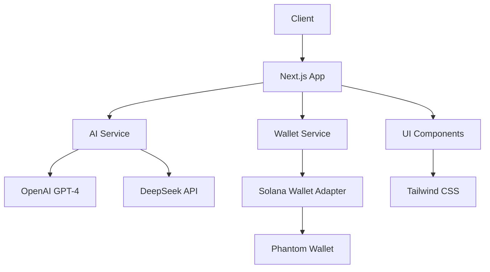
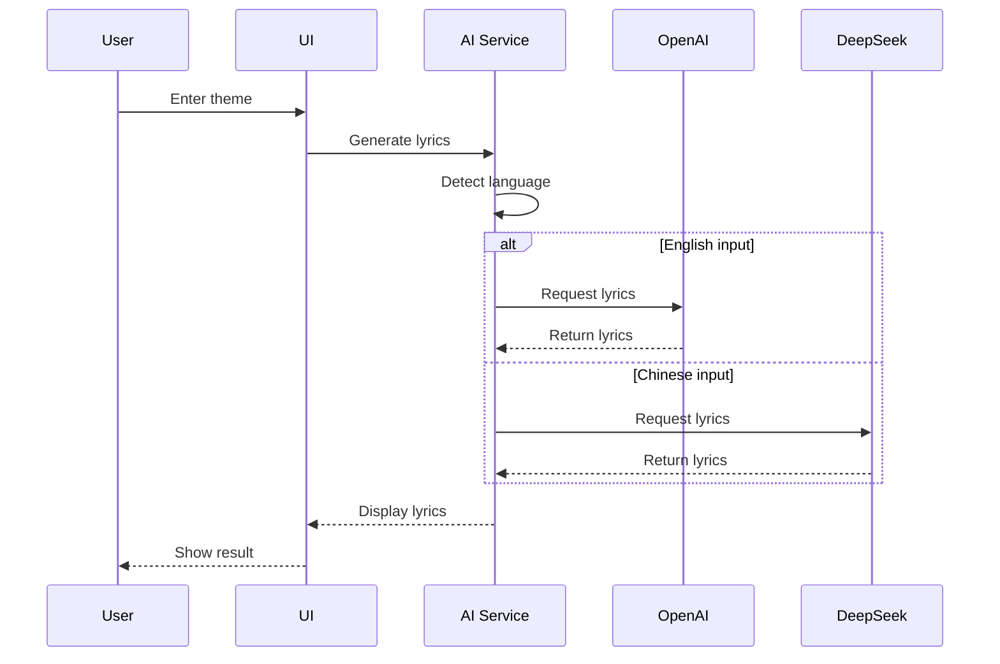

# Punklang - AI-Powered Lyrics Generator

<div align="center">
  
  <br/>
  <p>
    <strong>Create unique lyrics in the style of Pang Mailang</strong>
  </p>
  <p>
    <a href="https://punklang.xyz"><strong>🌐 Website</strong></a> • 
    <a href="https://x.com/punk_lang"><strong>🐦 Twitter</strong></a>
  </p>
</div>

Punklang is an innovative AI-powered lyrics generation platform that creates unique lyrics in the style of Pang Mailang. Built with Next.js and powered by advanced AI models, it offers a seamless experience for creating creative and engaging lyrics.

## Features

- AI-powered lyrics generation with dual model support
  - GPT-4 for English lyrics
  - DeepSeek for Chinese lyrics
- Real-time generation with intelligent language detection
- Solana wallet integration for future token features
- Modern, responsive UI with Tailwind CSS
- Mobile-friendly design
- Comprehensive error handling and fallback mechanisms

## Technical Architecture



## Project Structure

```
punklang/
├── src/
│   ├── app/              # Next.js app directory
│   │   └── page.tsx      # Main application page
│   ├── components/       # React components
│   │   ├── WalletConnect.tsx    # Wallet connection UI
│   │   ├── WalletProvider.tsx   # Wallet context provider
│   │   └── LyricsOutput.tsx     # Lyrics display component
│   ├── services/         # API and service functions
│   │   └── ai.ts         # AI service implementation
│   ├── styles/          # Global styles
│   └── utils/           # Utility functions
├── public/              # Static assets
└── config/             # Configuration files
```

## Data Flow



## Key Components

### AI Service (`src/services/ai.ts`)
- Dual model support with intelligent language detection
- Robust error handling and fallback mechanisms
- Caching system for improved performance

### Wallet Integration (`src/components/WalletProvider.tsx`)
- Solana wallet adapter integration
- Phantom wallet support
- Clean wallet state management
- Automatic connection handling

### UI Components
- Modern, responsive design
- Real-time feedback
- Error handling and loading states
- Mobile-first approach

## Tech Stack

- **Frontend**: Next.js 14, React, TypeScript
- **Styling**: Tailwind CSS
- **AI Models**: 
  - OpenAI GPT-4
  - DeepSeek API
- **Blockchain**: Solana
- **Wallet**: Phantom Wallet
- **Deployment**: Vercel

## Getting Started

### Prerequisites

- Node.js 18+ 
- npm or yarn
- OpenAI API key
- DeepSeek API key (optional)
- Phantom Wallet (for Solana features)

### Installation

1. Clone the repository:
```bash
git clone https://github.com/punklang/PML.git
cd punklang
```

2. Install dependencies:
```bash
npm install
```

3. Set up environment variables:
```bash
cp .env.example .env.local
```

4. Add your API keys to `.env.local`:
```
NEXT_PUBLIC_OPENAI_API_KEY=your_openai_key
DEEPSEEK_API_KEY=your_deepseek_key
```

5. Start the development server:
```bash
npm run dev
```

Visit `http://localhost:3000` to see the application.

## Development Scripts

- `start-dev.sh`: Development server startup script with error handling
- `restore.sh`: Backup restoration script
- `create-snapshot.sh`: System state snapshot creation

## Contributing

We welcome contributions! Please feel free to submit a Pull Request.

## License

This project is licensed under the MIT License - see the [LICENSE](LICENSE) file for details.

## Links

- Website: [PUNKLANG.XYZ](https://punklang.xyz)
- Twitter: [@punk_lang](https://x.com/punk_lang)
- GitHub: [punklang/PML](https://github.com/punklang/PML) 